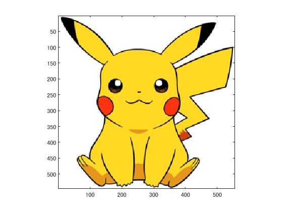
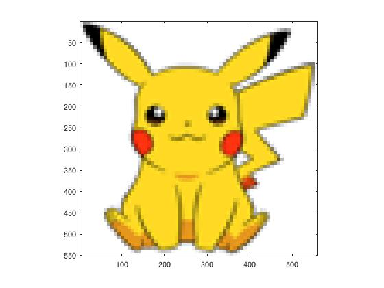
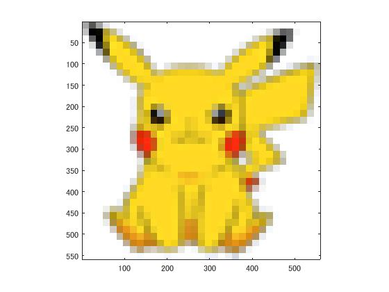
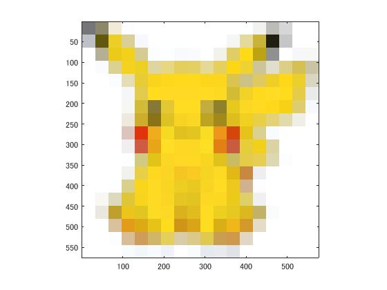

課題1レポート
=====================
標準画像「pokemon03」を現画像とする。
この画像は、縦545ピクセル、横554ピクセルによるディジタルカラー画像である。

図1原画像

原画像を1/2サンプリングするには，画像を1/2倍に縮小した後，2倍に拡大すればよい．なお，拡大する際には，単純補間するために「box」オプションを設定する．

IMG = imresize(ORG,0.5); % 画像の縮小
IMG2 = imresize(IMG,2,'box'); % 画像の拡大

1/2サンプリングの結果を図２に示す．

図2 1/2サンプリングの結果

同様に原画像を1/4サンプリングするには，画像を1/2倍に縮小した後，2倍に拡大すればよい．すなわち，

IMG = imresize(ORG,0.5); % 画像の縮小
IMG2 = imresize(IMG,2,'box'); % 画像の拡大

とする．1/4サンプリングの結果を図３に示す．

図４ 1/4サンプリングの結果

1/8から1/32サンプリングは，

IMG = imresize(ORG,0.5); % 画像の縮小
IMG2 = imresize(IMG,2,'box'); % 画像の拡大

を繰り返す．サンプリングの結果を図４～６に示す．

図5 1/8サンプリング結果

図6 1/16サンプリング結果

図7 1/32サンプリング結果

このようにサンプリング幅が大きくなると，モザイク状のサンプリング歪みが発生する．
